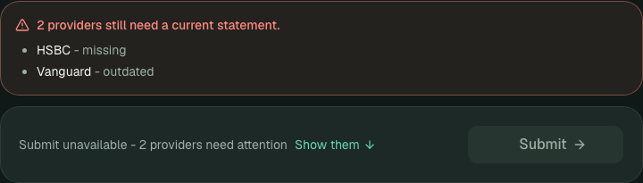

# Notes

The README covers running FINON and shows the screens. This file is my reasoning. The *frontend* is the screen in the browser; the *backend* is the Java program behind it, which holds the rules and the data in its database.

## 1. Engineering approach and architecture

The screen has one job: answer **"is the client ready to submit?"** So the key decision is where that answer is worked out. **The backend decides.** It works out each statement's status and whether the client can submit, on every request, and the frontend only shows the answer. I rejected calculating it on the screen because the same rule in two places drifts apart. The backend also **checks again on Submit**, because the screen is only a guide and anyone can call the backend directly.

Nothing is saved that can be worked out: a stored "Uploaded" status would still say so the day after it expired. Only providers, accounts, statement dates and files are saved. Screen-only details (filters, search, open pop-ups) stay in the frontend, and TanStack Query keeps a temporary copy of backend data, re-fetched after every change.

It is one small Spring Boot backend (Java 21), not several services, with React and TypeScript in front, hosted on Vercel and Render. Every error has one shape (a code, a client-friendly message and, for a refused submit, the providers at fault), and 422 means "valid request, not ready". I built the rules and tests first and the screen second.

## 2. Domain modelling and business rules

| Situation | Result |
|---|---|
| No statement | **Missing** |
| Dated within three calendar months (exactly three counts) | **Uploaded** |
| Older than three calendar months | **Outdated**: accepted and kept so the client sees what to replace, but it does not count and blocks submitting |
| Dated in the future | **Refused (400)** |
| Anything Missing or Outdated, or no providers | **Submit refused (422)** |

- **Calendar months, not 90 days** (31 May minus three months is 28 February). An injectable clock lets tests pin the boundary day.
- **No provider twice, however it is typed.** One rule ignores capitals, accents, spacing, punctuation and "&", so `HSBC` and `H.S.B.C.` match, and a duplicate refuses the whole request. Providers typed under "Other" stay personal and never join the shared list.
- **Uploaded files must actually open.** The backend checks what a file really is and that it is whole. Damaged files are refused; a genuine file with the wrong ending is accepted. A password-protected PDF is accepted as intact, but an adviser could not read it without the password, which I have not solved.
- **File handling and onboarding rules are separate on purpose.** Readiness uses metadata only: provider, the client-entered date and the resulting status. FINON never reads balances or dates out of a document, so it confirms a client *says* a statement is recent, not that the document proves it. The screen records a statement only after its file passes the checks, and the API also accepts a metadata-only request, so a better file check can never change who may submit.

## 3. UX and design decisions

- **Submit looks switched off but can still be pressed** (`aria-disabled`). Pressing it early shows the backend's reason and outlines the cards to fix, which a disabled button cannot do. The downside is that a button that looks off yet responds could puzzle some people, so a line beside it says "Submit unavailable - 2 providers need attention" and the refusal is announced as an alert.
- **One tap from "what is left?" to done.** Each progress-bar segment and provider name in the summary opens the right action.
- **The verdict comes before the commitment.** The calendar says in words whether a date counts, and no date is pre-selected.
- **Accessible.** Keyboard and screen-reader support, status never by colour alone, reduced-motion respected, and it works on a phone.

## 4. Testing strategy and CI

There are **48 backend**, **94 frontend** and **2 real-browser** tests, covering the boundary day, duplicates, refused submits (including direct API calls), file checks, and one full journey from refused to successful submit. GitHub runs them on every pull request and merge to `main`. The deploy step needs them all to pass, Vercel's deploy-on-push is off for `main`, and Render only updates after the checks succeed. Since the checks were set up, every change has gone through a pull request; the first two commits went straight to `main`, and branch protection is not yet on. Results: https://github.com/oliviao12345/FINON/actions.

## 5. Trade-offs and limitations

- **Short-term memory (H2) instead of a saved database.** Nothing to install and every demo starts the same, but everything, including uploaded files, is lost when the backend restarts or the free host sleeps.
- **I went beyond the brief.** It asked for a name and a date in about two hours. I knowingly built file storage, previews, categories with drag and drop, a custom calendar and smart search, because the product is only convincing if a client can see and trust what they uploaded. A strict two-hour version would cut those and keep backend-owned readiness, the three statuses, duplicate protection and the tests.
- **The provider list is a reviewed file**, not a live feed: no free service lists everyday consumer providers.
- **Word files are drawn in the browser**, so private documents never leave the app; old `.doc` files download.
- **Java, not Kotlin.** The brief allowed either; the design translates directly.
- **Not safe for real documents.** There is no sign-in and one client (both out of scope), yet files are stored, so **do not upload real financial documents to the demo**. My checks do not scan for malware or prove a file is a genuine statement.

## 6. AI-assisted development

I used **Claude Code CLI** as an implementation partner to set up the projects, write code, generate tests and draft documentation. I made the decisions and it carried them out: I described the behaviour first, then tried each result in the running app and sent it back for changes.

For the design, I defined the user as a high-net-worth client expecting a premium, professional, trustworthy experience, and gave the AI references from fintech products including Investa and Finary for typography, colour, layout and feel (not their trading screens). I judged the output by how well it showed progress and what was outstanding, not just how attractive it looked.

Review changed two things. The first file check refused any file whose contents did not match its ending; I pushed back, since a genuine renamed file is fine and a *broken* one is not, so it now looks inside the file. The first version also quietly assumed a category; I asked for the suggestion to be visible and editable.

Most tests were written with AI help, so I treated them as a safety net, not proof, and read them against my rules.

## 7. Future improvements

- **Warn before a statement runs out.** A small note on the card when a statement will stop counting within 14 days, suggesting a newer one. It would never block an upload or add a status.
- A saved database and file storage, a safe-to-repeat submission record, a regular check of the provider list against the Bank of England, PRA and FCA registers, rate limiting and logging, branch protection, and more accessibility tests.
