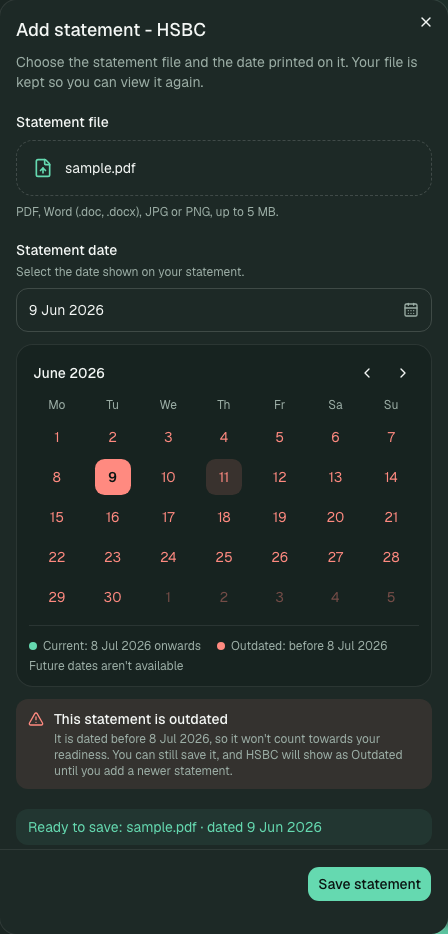
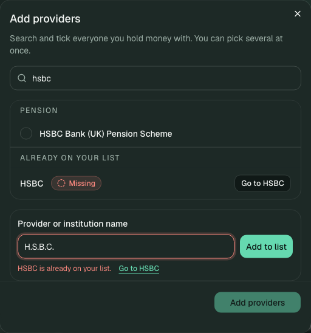
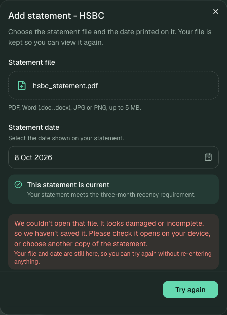
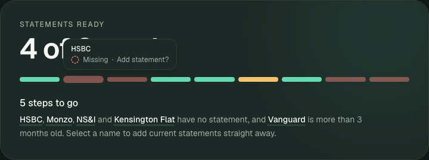
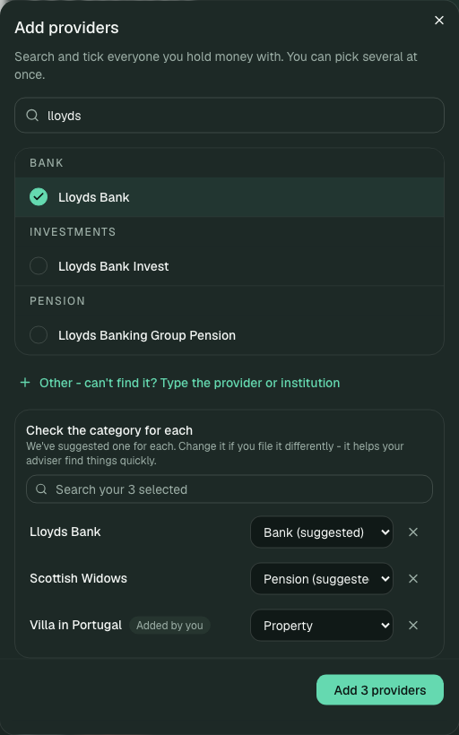
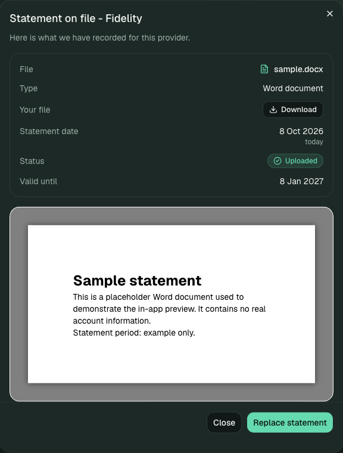

# Notes

The README shows how to run FINON, with screenshots and diagrams. This file explains my thinking: where each rule lives, why I made each choice, what I left out, and how I used AI. It should take about five minutes to read.

**Three words used throughout**

| Word | What it means |
|---|---|
| **Frontend** | The screen the client sees and clicks in the browser. |
| **Backend** | The Java program behind the screen. It holds the rules and the data, and answers when the frontend asks it something. |
| **Database** | Where the backend keeps its data (the providers, the statements and the uploaded files). |

1. [Approach and key decisions](#1-engineering-approach-and-key-decisions)
2. [Where information lives](#2-state-modelling-and-ownership)
3. [The business rules](#3-business-rules-and-validation)
4. [How the screen and backend talk](#4-api-design-and-error-handling)
5. [Design and accessibility](#5-ux-decisions-and-accessibility)
6. [Testing and automatic checks](#6-testing-strategy-and-ci)
7. [Trade-offs, limits and next steps](#7-trade-offs-limitations-and-next-steps)
8. [How I used AI](#8-ai-assisted-development-and-verification)

## 1. Engineering approach and key decisions

The screen has one job: to answer **"is the client ready to submit?"** Almost every decision below comes from choosing where that answer is worked out.

| What I decided | What I could have done instead | Why I chose this |
|---|---|---|
| The **backend** decides whether a statement counts and whether the client may submit. | Work it out on the screen from the dates. | There is one place that knows the answer. If the same rule is written in two places, the two copies can drift apart and disagree. |
| The backend **checks again when Submit is pressed**. | Trust that the Submit button was switched off. | The screen is only a guide. Anyone can skip it and talk to the backend directly, so the backend has to protect the rule itself. |
| **One backend program.** | Several small separate programs. | The task is small and has one purpose. More pieces would add work without helping. |
| **Build the rules first, then the screen.** | Start with how it looks. | I got adding, uploading and submitting working and tested first, then built the interface on top, so the polish never ran ahead of the logic. |

## 2. State modelling and ownership

"State" here just means the information the app is tracking. I split it into four kinds, depending on whether it is saved, worked out, or only needed on screen.

| Kind | Examples | Where it lives | Why |
|---|---|---|---|
| **Saved** | The list of providers, the client's chosen providers and categories, each statement's file name and date, the uploaded file | The database, run by the backend | This is what the client actually gave us. |
| **Worked out each time** | A statement's status (Missing, Uploaded or Outdated), how many are ready, whether the client can submit, which providers are holding things up | The backend, recalculated whenever the screen asks | The answer changes as time passes. If I saved it, a statement could still say "Uploaded" the day after it expired. |
| **A temporary copy on the screen** | The list of providers and accounts the backend last sent | A library called TanStack Query in the frontend | It looks after "loading", "failed" and "worked" for every request. After every change the screen asks the backend for a fresh copy. |
| **Screen-only details** | Which filter is selected, what is typed in a search box, which pop-up is open, a half-filled form | The frontend's own memory | Nothing outside the screen needs to know these. |

**The option I turned down.** I could have let the frontend work out "ready to submit" from the statement dates. That would have been less to send back from the backend, but it would mean the same rule written twice. Instead, the progress bar, the sentence under it, the Submit button and the backend's own check all show the backend's single answer, so they cannot disagree.

## 3. Business rules and validation

### Statement status

| Situation | Result | Why |
|---|---|---|
| No statement | **Missing** | Nothing has been supplied. |
| Dated within the last three calendar months | **Uploaded** | It is recent enough. |
| Dated exactly three calendar months ago | **Uploaded** | The cut-off day itself still counts. |
| Older than three calendar months | **Outdated** | It is kept, but it does not count and it blocks submitting. |
| Dated in the future | **Refused (error 400)** | A statement cannot have been issued in the future. |
| Any provider Missing or Outdated, or no providers at all | **Submit refused (error 422)** | The backend only accepts a complete set. |

Two choices I can explain:

- **Three calendar months, not 90 days.** Months are different lengths, so I count back three months on the calendar the way a person would (31 May minus three months is 28 February). The clock is set up so the tests can fix "today", which lets me test the exact boundary day.
- **An outdated statement is accepted, not turned away.** It is real information that just isn't recent enough. Keeping it lets the client see exactly what needs replacing instead of losing the record, and it means all three statuses really exist. The calendar warns about this before saving, but the backend has the final say.

### Other rules the backend enforces

- **No provider can be added twice, however it is typed.** One rule decides whether two names are "the same": it ignores capitals, accents, spaces and punctuation, and treats "&" and "and" alike. So `HSBC`, `H.S.B.C.` and `hsbc` count as one provider. This is checked for the provider list, for names the client types in, for what is already on their list, for repeats within one request, and for the provider list itself (the app will not start if two entries match). If a request contains a duplicate, the whole request is refused and nothing is added.
- **Providers the client types in under "Other" stay personal.** They belong to that client only and never join the shared provider list, so they can never appear as a choice for anyone else.
- **An uploaded file must actually open.** The backend looks inside the file to see what it really is, then checks it is whole: PDFs must load, pictures must display, Word files must be complete. A damaged file is refused and nothing is saved. A genuine file with the wrong ending is accepted, because turning it away would annoy people without protecting anything.
- **The category is the client's choice.** It is pre-filled with a suggestion that the client can see and change, and it must be one from a fixed list.

<table>
<tr>
<td align="center" valign="top"></td>
<td align="center" valign="top"></td>
<td align="center" valign="top"></td>
</tr>
<tr>
<td align="center">The date rule is shown before saving</td>
<td align="center">A duplicate is caught, with a link to the existing one</td>
<td align="center">A damaged file is refused, nothing is lost</td>
</tr>
</table>

## 4. API design and error handling

The "API" is simply the set of requests the frontend can make to the backend. The full list is in the [README](README.md#api). The choices behind it:

- **One request gives the whole picture.** The request for the client's accounts returns the list *and* the ready summary, so the screen never needs a second request to know whether the client can submit.
- **Every change sends back the updated list.** So the screen can never be out of step with the backend.
- **Every error looks the same:** a short code (for programs and tests), a message written for the client (shown exactly as it is), and, when a submit is refused, the list of providers holding it up. They all come from one place in the code, so errors are consistent.
- **The error numbers mean something.** 400 means the request itself was wrong (a future date, a bad name, an unreadable file). 404 means it points at something that does not exist. 409 means a duplicate. 413 means the file is too big. 422 means the request was fine but the situation is not ready, for example submitting while a statement is missing. I kept 400 and 422 apart on purpose.
- **Each check lives in one sensible place.** Simple checks on the shape and size of a request happen as it arrives. The real rules (duplicates, dates, completeness) sit in the backend's main logic, where the tests can reach them directly.

## 5. UX decisions and accessibility

- **The Submit button looks switched off but can still be pressed.** I coded it as "looks disabled" (`aria-disabled`) instead of truly disabled. A premature press then shows the backend's explanation and outlines the cards that need fixing. A dead button tells the client nothing. This is the clearest example of a business rule shaping the design.
- **From "what is left?" to done in one tap.** Every segment of the progress bar, and every provider name in the summary sentence, opens the right action for that provider. The line "N providers need attention" shows only those providers. Hovering a bar says what a tap will do ("Add statement?").
- **Show the verdict before the client commits.** The calendar knows today's date, marks older dates red and says in words whether the statement counts. No date is pre-selected, so no message appears about a date the client has not chosen.
- **Show the defaults.** Category dropdowns are pre-filled with a suggestion the client can see and change, instead of being set quietly.
- **Easy to undo and hard to lose work.** Removing a provider asks first. If an upload fails, the chosen file and date stay in place so nothing has to be typed again.
- **Usable by everyone.** It works with a keyboard and a screen reader, status is never shown by colour alone (always an icon and a word), animations respect the "reduce motion" setting, and the layout works on a phone.

<table>
<tr>
<td align="center" valign="top"></td>
<td align="center" valign="top"></td>
</tr>
<tr>
<td align="center">Categories you can see and change</td>
<td align="center">View what was uploaded, right there</td>
</tr>
</table>

## 6. Testing strategy and CI

I tested the things I most wanted to protect, as close to the code as possible, and then checked the whole journey in a real browser.

| Where | Tests | What they protect |
|---|---|---|
| **Backend** | **48** | The rules: statuses on the exact boundary day, duplicates however they are typed, submit being refused (including when the backend is called directly), categories, personal providers staying out of the shared list, and the file checks (real files accepted, damaged ones refused, a genuine renamed file accepted). |
| **Frontend** | **94** | That the screen follows what the backend says, shows loading, success and failure messages, and handles searching, filtering, the shortcuts, the calendar, categories, the file viewer and duplicates. |
| **Real browser** (Playwright) | **2** | One full journey: submitting too early is refused, a damaged upload is refused, statements are added and replaced, a Word document is previewed, a card is dragged to another category, providers are added and removed, and the pack is submitted. The second test checks a scrolling pop-up keeps its buttons in place, added after a real bug. |

**Automatic checks before anything goes live.** "CI" means GitHub runs all of these tests by itself every time code changes. The live site and the backend only update once they pass. Vercel's own automatic update is switched off for the main branch, and a final step triggers the update only after the tests succeed. I made every change through a pull request (a proposed change that is checked before it is merged).

**A note on the tests.** I had AI help write most of them, so I treated them as a safety net and not as proof. What matters is that each one checks a rule I had specified.

## 7. Trade-offs, limitations and next steps

| What I chose | What I could have done | What it costs |
|---|---|---|
| Keep all data in the backend's **short-term memory** (a small database called H2) | Use a proper saved database such as PostgreSQL | Nothing to install and every demo starts the same. But the data is only kept while the backend is running. When it restarts, or the free host puts it to sleep after a quiet spell, everything the client did is forgotten and the four starting providers return. That includes uploaded files. |
| **Keep the actual file** (the brief only asked for a name and a date) | Record just the name and date | The client can open what they uploaded, but it means the app stores documents. See the security note below. |
| A **provider list kept in a file** that I review | Fetch it live from a service | No free service lists everyday consumer providers. A file is cheap and easy to check, but it only stays current if someone updates it. |
| **Draw Word files inside the page** | Send them to Google's or Microsoft's viewer | Private documents never leave the app. The limit is that older `.doc` files cannot be drawn reliably, so those offer a download instead. |
| **Don't save the "submitted" moment** | Save a record of each submission | The backend checks and confirms the submit but keeps no history of it. |

**Java instead of Kotlin.** The brief allowed either ("Kotlin/Java") and I used Java 21. Nothing in the design depends on Java: the data shapes are Java "records", which become Kotlin data classes, and the rules sit in ordinary methods that translate directly.

**Not safe for real documents as it stands.** The demo has no sign-in and only one client, yet it stores uploaded files. A real version would need sign-in, rules about who can see what, encrypted storage, virus scanning, rules for how long files are kept, and a log of who did what. I have not built these, and the demo must not be used with real financial documents.

**What I chose not to build:** sign-in, more than one client, a permanent database, a history of submissions, and a live provider feed. Each was either outside the brief or needs services the exercise does not have.

**A feature I would add next: warn before a statement runs out.** Today FINON only says a statement is out of date after the three months are up. A friendlier version would warn the client *beforehand*. If a statement that is being uploaded, or one already on file, will stop counting within 14 days, the card would show a small note (not a pop-up), for example: "This statement stops counting on 21 October. You can still use it, but a newer one will last longer." It would never block an upload, only suggest a better one.

I left it out on purpose. The brief is about three statuses and one submit rule, and this adds a fourth, in-between state ("about to run out") that needs its own rule, wording, tests and a decision on whether it should affect "ready". It would also be easy to overdo. I like it because it moves FINON from telling clients about problems to helping them avoid them, and the backend already works out each statement's "valid until" date, so it is a small step from here.

**With more time:** a permanent database and proper file storage; a saved record of each submission, made so pressing Submit twice cannot cause problems; a regular check of the provider list against the official Bank of England, PRA and FCA registers; limits on how often the backend can be called, plus better logging; and more browser tests (on a phone-sized screen and with the keyboard only) along with automatic accessibility checks.

## 8. AI-assisted development and verification

I used **Claude Code** (an AI coding tool I ran from the command line) as an implementation partner, mostly to set up the projects, write the screen and backend code, generate tests and draft the documentation. I made the decisions and it carried them out.

**How I worked.** I described the behaviour and the rules first, had the AI build against them, then tried the result in the running app and corrected it. It was a back-and-forth, not one request that produced the whole app.

**Decisions I made and directed:** the choice of tools and the split between Vercel and Render; having the backend decide readiness; keeping Submit pressable; accepting outdated statements; keeping real files beyond the brief; keeping typed-in providers out of the shared list; one strict rule for duplicates; categories that are visible and editable; and the rule that nothing goes live unless the automatic checks pass.

**Two times my review changed the result:**

- *Checking uploaded files.* The first version refused any file whose contents did not match its ending. I pushed back: a genuine document with the wrong ending is fine, while a *broken* file is not. We changed it to look inside the file, so damaged files are refused and renamed ones are accepted.
- *Choosing a category.* The first version quietly assumed a category. After using it in the browser I asked for the suggestion to be shown and editable before saving.

**How I checked the work.** Automatic tests at three levels, hands-on trying in the browser, and pull requests with the checks required before every merge. I did not treat AI-written tests as proof on their own; I read them against the rules I had set.

I can walk through any file and explain why it looks the way it does.
