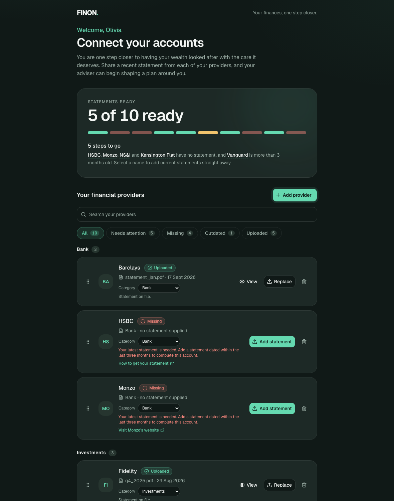
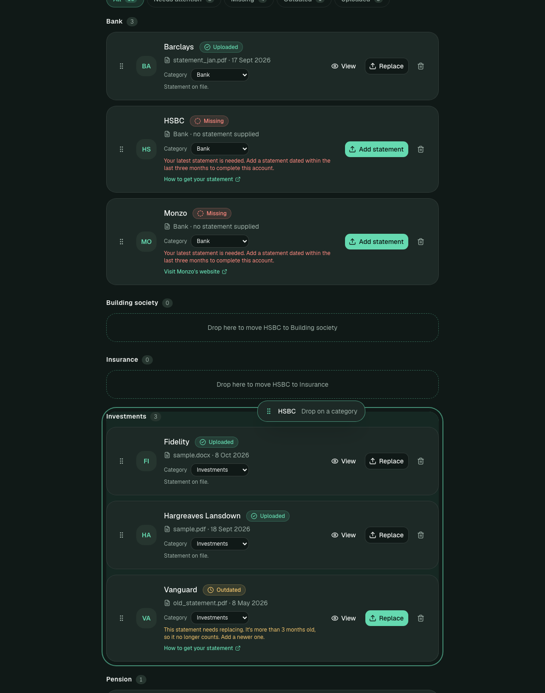
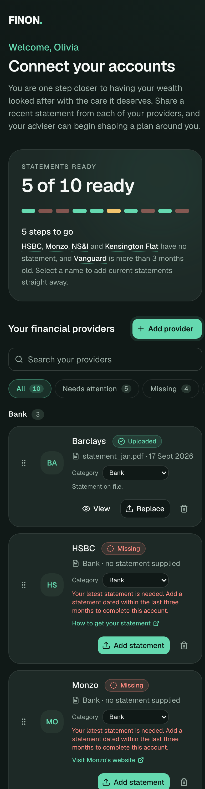
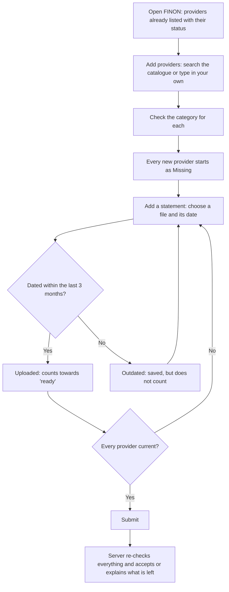
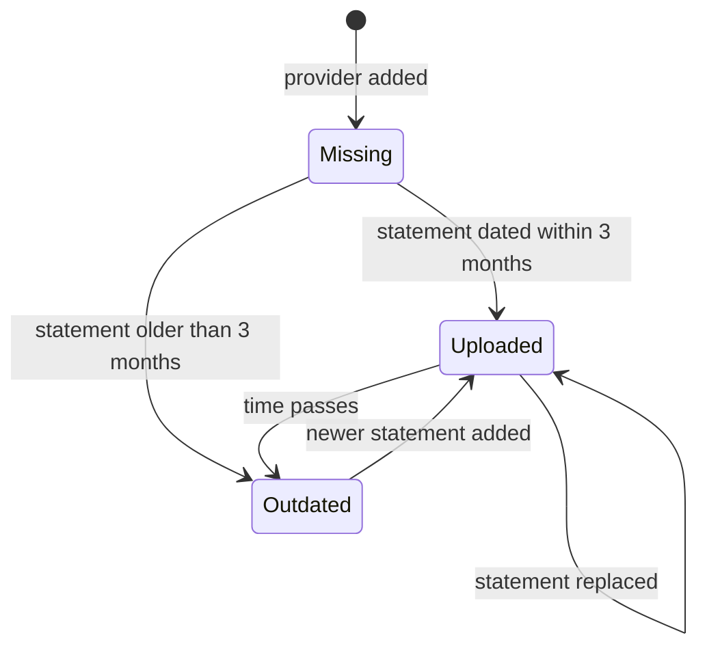
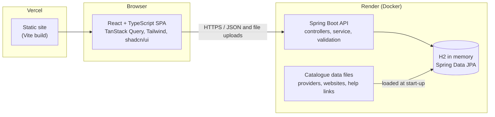
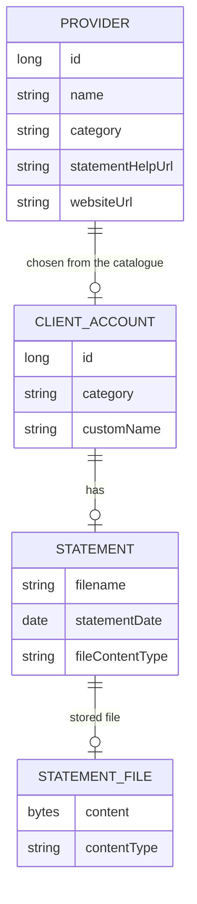
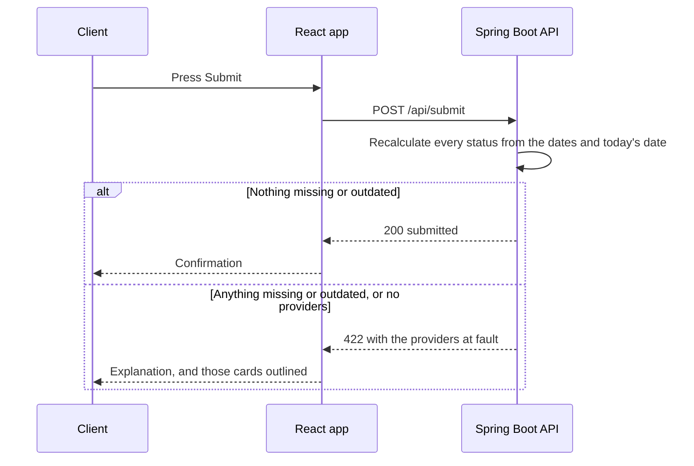
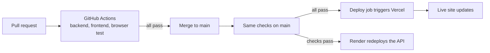

# FINON

**Your finances, one step closer.** FINON is a statement-collection screen for wealth-advice clients. A client lists every provider they hold money with, supplies a recent statement for each, and submits a complete onboarding pack once everything is current.

**Live demo:** https://finon-green.vercel.app
**API:** https://finon-api.onrender.com (the free host sleeps when idle, so the first load after a quiet spell can take up to a minute; data resets whenever it restarts)



## What it does

- Shows every provider the client has added, whether we hold a **current** statement for it, and how close they are to being ready ("5 of 10 ready").
- Lets the client add providers from a catalogue of about 230 UK banks, building societies, platforms, pensions and insurers, pick several at once, or type in anything missing.
- Groups providers by a category the client chooses (changeable by dropdown or drag and drop); anything typed in sits in its own "Added by you" section.
- Accepts a statement as a real file (PDF, Word, JPG or PNG up to 5 MB) plus the date printed on it, refuses damaged files, and lets the client view what they uploaded.
- Turns "what is left?" into one tap: every segment of the progress bar, and every provider name in the summary sentence, jumps straight to that provider and opens the right action, and a "Needs attention" filter shows only what is left.
- Lets the client submit only when every provider has a current statement, **enforced by the server**, with a clear explanation when something is still wrong.

## Screens

| | |
|---|---|
|  |  |
| **Adding providers.** Search with forgiving matching ("hl" finds Hargreaves Lansdown), tick several, type in anything missing, and check each category (pre-filled, editable) before adding. | **Choosing the statement date.** The calendar knows today's date: older dates turn red and the message says plainly whether the statement counts. |
|  |  |
| **Viewing what was uploaded.** Details, Open and Download, and an in-app preview of PDFs, images and Word documents. | **Organising by category.** Drag a card onto any category (empty ones appear as drop targets); the dropdown on each card does the same. |

### From "what is left?" to done in one tap


Each bar segment is a button. Hovering or tabbing to one shows the provider, its status and what a tap will do ("Add statement?"); tapping it scrolls to that provider and opens the Add or Replace dialog straight away. The names in the sentence beneath (dotted underline) do the same, and "Submit unavailable - 5 providers need attention" is itself a shortcut that filters the list to what is left.

<p align="center"></p>

On a phone the cards stack, the filter pills scroll sideways and every control stays thumb-sized.

## The client journey



## Statement status

A status is **never stored**; it is worked out from the statement date every time it is read.



"Within 3 months" means three **calendar** months, and a statement dated exactly three months ago still counts.

## Architecture



The server owns every rule. The screen renders what the API returns (including the ready count and whether submitting is allowed) and never recomputes it, so the two cannot disagree.

### Data model



A provider typed in by the client has no `PROVIDER` row at all: its name lives only on the client's own account, so it can never appear in the shared catalogue.

### Submitting



### API

| Method | Path | Purpose |
|---|---|---|
| GET | `/api/providers` | Catalogue, excluding providers already added |
| GET | `/api/accounts` | Client accounts, derived statuses and readiness |
| POST | `/api/accounts` | Add catalogue providers and/or typed-in names, with categories |
| DELETE | `/api/accounts/{id}` | Remove a provider |
| PUT | `/api/accounts/{id}/statement` | Store a statement: multipart file and date (or JSON name and date) |
| GET | `/api/accounts/{id}/statement/file` | The stored file, served as its real type |
| PUT | `/api/accounts/{id}/category` | Change a provider's category |
| POST | `/api/submit` | Validate everything; 200, or 422 listing what is left |

The reasoning behind the rules is written up in [NOTES.md](NOTES.md).

## Run it locally

Requires Node 22+ and JDK 21 with Maven.

```sh
# terminal 1: the API on :8080
cd backend && mvn spring-boot:run

# terminal 2: the site on :5173 (proxies /api to the API)
cd frontend && npm install && npm run dev
```

Open http://localhost:5173. The API seeds four demo providers each time it starts: Barclays and Fidelity (current), HSBC (missing) and Vanguard (outdated).

## Tests

```sh
cd backend && mvn test              # API rules and file checks
cd frontend && npm test             # components and logic
cd frontend && npm run e2e          # real browser: starts both servers
E2E_API_PORT=8081 E2E_WEB_PORT=5174 npm run e2e   # same, beside a running dev setup
```

The browser test walks the whole flow: a premature submit is refused, a damaged file is refused, statements are added and replaced, a Word document is previewed, a card is dragged between categories, providers are added and removed, and the pack is finally submitted.

## CI and deployment



Nothing reaches production unless the checks pass: Vercel's own deploy-on-push is switched off for `main`, and Render only redeploys after the GitHub checks succeed.

### Configuration

| Variable | Where | Purpose |
|---|---|---|
| `VITE_API_BASE_URL` | frontend build | Public origin of the API (empty in development) |
| `FINON_CORS_ORIGINS` | backend | Comma-separated origins allowed to call the API |
| `PORT` | backend | Listen port (default 8080) |

### Demo limits

The database is in memory, so all changes (including uploaded files) vanish when the API restarts, and the free host sleeps when idle. That is a deliberate demo trade-off, covered in [NOTES.md](NOTES.md).
